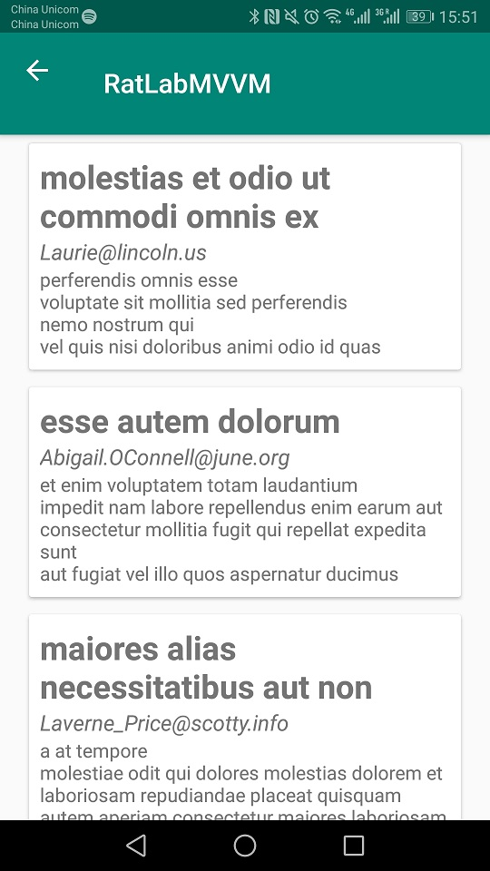
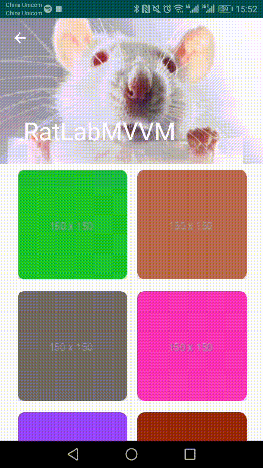

# RatLab 

## Project Overview

Experimentation app made with kotlin, AAC, Navigation-component, Koin,...

## ScreenShots

Users|User Page|Posts|Gallery| 
:-------------------------:|:-------------------------:|:-------------------------:|:-------------------------:|
|||  

## Libraries
* [rxAndroid](https://github.com/ReactiveX/RxAndroid) - Library for composing asynchronous and event-based programs by using observable sequences.
* [rxBinding](https://github.com/JakeWharton/RxBinding) - RxJava binding APIs for Android's UI widgets.
* [Room](https://developer.android.com/topic/libraries/architecture/room) - The Room persistence library provides an abstraction layer over SQLite to allow for more robust database access while harnessing the full power of SQLite.
* [Navigation Component](https://developer.android.com/guide/navigation/navigation-getting-started) - The Navigation component is a suite of libraries, tooling and guidance for in-app navigation. The component centralizes all of the navigation information of your app in a navigation graph, providing a robust framework for implementing everything from simple button clicks to complex navigation UI patterns.
* [Koin](https://insert-koin.io/) - A pragmatic lightweight dependency injection framework for Kotlin developers. Written in pure Kotlin using functional resolution only: no proxy, no code generation, no reflection!
* [Retrofit2](http://square.github.io/retrofit/) - A type-safe HTTP client for Android and Java
* [Picasso](https://square.github.io/picasso/) - A powerful image downloading and caching library for Android
* [Moshi](https://github.com/square/moshi) - A modern JSON library for Kotlin and Java
* [Epoxy](https://github.com/airbnb/epoxy) - Epoxy is an Android library for building complex screens in a RecyclerView
* [Lottie](https://airbnb.design/lottie) - Easily add high-quality animation to any native app. 

